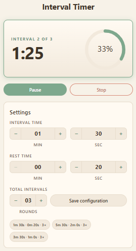

# Interval Timer App

A React-based interval workout timer that lets users configure work/rest cycles and tracks progress through each session. Settings persist across visits so previously used configurations are always one click away.




## Features

- **Configurable intervals** — set active interval duration, rest duration, and total interval count (in minutes and seconds)
- **3-second countdown** before the first interval begins
- **Circular progress bar** tracking completed intervals across the session
- **Pause / Resume / Stop** controls at any point during a session
- **Persistent settings** — the last three used configurations are saved to `localStorage` and surfaced for quick reuse

## Architecture

The codebase is split into three distinct layers to keep logic testable and independent of the UI:

| Layer | Location | Responsibility |
|---|---|---|
| Domain logic | `src/utils/timerEngine.js` | Pure functions for time math, phase transitions, and progress calculation — no React, no side effects |
| Runtime state | `src/hooks/useTimer.js` | Custom hook that owns all timer state and drives the `setInterval` / countdown lifecycle |
| Persistence | `src/services/configService.js` | Factory-based service with an injected storage adapter (`localStorageAdapter.js`), making it fully unit-testable without a real browser |

`App.js` composes the `Settings`, `Timer`, `ProgressBar`, and `Controls` components and delegates all timer logic to `useTimer`.

## Getting Started

```bash
npm install
npm start        # development server on http://localhost:3000
npm test         # Jest + React Testing Library
npm run lint     # ESLint (with jsx-a11y and react-hooks plugins)
```

## Technologies

- **React 18** with functional components and hooks
- **react-circular-progressbar** for session progress visualization
- **Jest** + **React Testing Library** for unit and component tests
- **ESLint** (jsx-a11y, react, react-hooks plugins)
- **Docker** (multi-stage build: Node 20 → nginx:alpine)
- **GitHub Actions** for CI and automated Docker image publishing
- **Azure VM** for production hosting via Docker Compose

## Deployment

### CI
- Runs `npm run lint` and `npm test` for:
	- every PR targeting `main`
	- every push to `main`
- Workflow file: `.github/workflows/ci.yml`.

### Build & Deploy
- `.github/workflows/docker-deploy.yml` runs deployment after the CI workflow completes successfully on `main`.
- The workflow can also be triggered manually with `workflow_dispatch`.
- Docker image builds are cached in GitHub Actions for faster rebuilds.
- The Azure VM pulls the new image and redeploys via `docker-compose.yml`.
- `docker-compose.yml` sets `restart: always` for resilience and reads `PORT` from an environment variable (defaults to `80`).
- A `healthcheck` polls `http://localhost/` every 30 seconds to confirm the container is healthy.

## Branching Strategy

- `main` is the only production branch.
- Use short-lived branches: `feature/*`, `fix/*`, `hotfix/*`.
- Merge to `main` through pull requests only.
- Recommended GitHub branch protection on `main`:
	- require pull request before merge
	- require the CI workflow status checks to pass
	- require branch to be up to date before merge
	- require at least one approval
	- restrict direct pushes
